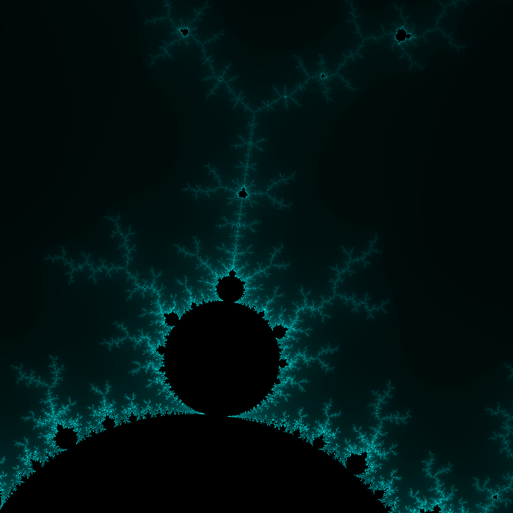

# mandelbrot

## Output

### complex64


### complex128



#### Compare complex64 with complex128

```bash
$ compare ./assets/complex64.png ./assets/complex128.png ./assets/diff_complex64_complex128.png
```


### big.float


#### Compare complex128 with big.float

```bash
$ compare ./assets/complex128.png ./assets/float.png ./assets/diff_complex128_float.png
```


## Performance

### complex64

```bash
$ /usr/bin/time -v go run mandelbrot.go -t complex64 > /dev/null
        Command being timed: "go run mandelbrot.go -t complex64"
        User time (seconds): 0.75
        System time (seconds): 0.13
        Percent of CPU this job got: 111%
        Elapsed (wall clock) time (h:mm:ss or m:ss): 0:00.80
        Average shared text size (kbytes): 0
        Average unshared data size (kbytes): 0
        Average stack size (kbytes): 0
        Average total size (kbytes): 0
        Maximum resident set size (kbytes): 51496
        Average resident set size (kbytes): 0
        Major (requiring I/O) page faults: 402
        Minor (reclaiming a frame) page faults: 7241
        Voluntary context switches: 2848
        Involuntary context switches: 83
        Swaps: 0
        File system inputs: 0
        File system outputs: 3240
        Socket messages sent: 0
        Socket messages received: 0
        Signals delivered: 0
        Page size (bytes): 4096
        Exit status: 0
```

### complex128

```bash
$ /usr/bin/time -v go run mandelbrot.go -t complex64 > /dev/null
        Command being timed: "go run mandelbrot.go -t complex128"
        User time (seconds): 0.58
        System time (seconds): 0.10
        Percent of CPU this job got: 116%
        Elapsed (wall clock) time (h:mm:ss or m:ss): 0:00.58
        Average shared text size (kbytes): 0
        Average unshared data size (kbytes): 0
        Average stack size (kbytes): 0
        Average total size (kbytes): 0
        Maximum resident set size (kbytes): 53484
        Average resident set size (kbytes): 0
        Major (requiring I/O) page faults: 402
        Minor (reclaiming a frame) page faults: 6798
        Voluntary context switches: 2948
        Involuntary context switches: 64
        Swaps: 0
        File system inputs: 0
        File system outputs: 3240
        Socket messages sent: 0
        Socket messages received: 0
        Signals delivered: 0
        Page size (bytes): 4096
        Exit status: 0
```

### big.float

```bash
$ /usr/bin/time -v go run mandelbrot.go -t float > /dev/null
        Command being timed: "go run mandelbrot.go -t float"
        User time (seconds): 92.45
        System time (seconds): 6.59
        Percent of CPU this job got: 118%
        Elapsed (wall clock) time (h:mm:ss or m:ss): 1:23.52
        Average shared text size (kbytes): 0
        Average unshared data size (kbytes): 0
        Average stack size (kbytes): 0
        Average total size (kbytes): 0
        Maximum resident set size (kbytes): 53664
        Average resident set size (kbytes): 0
        Major (requiring I/O) page faults: 402
        Minor (reclaiming a frame) page faults: 98241
        Voluntary context switches: 314278
        Involuntary context switches: 889
        Swaps: 0
        File system inputs: 0
        File system outputs: 3240
        Socket messages sent: 0
        Socket messages received: 0
        Signals delivered: 0
        Page size (bytes): 4096
        Exit status: 0
```

### big.rat

```bash
$ /usr/bin/time -v timeout -s INT 90 go run mandelbrot.go -t rat > /dev/null
signal: interrupt
Command exited with non-zero status 124
        Command being timed: "timeout -s INT 90 go run mandelbrot.go -t rat"
        User time (seconds): 90.54
        System time (seconds): 0.68
        Percent of CPU this job got: 101%
        Elapsed (wall clock) time (h:mm:ss or m:ss): 1:30.00
        Average shared text size (kbytes): 0
        Average unshared data size (kbytes): 0
        Average stack size (kbytes): 0
        Average total size (kbytes): 0
        Maximum resident set size (kbytes): 53520
        Average resident set size (kbytes): 0
        Major (requiring I/O) page faults: 402
        Minor (reclaiming a frame) page faults: 17617
        Voluntary context switches: 32229
        Involuntary context switches: 343
        Swaps: 0
        File system inputs: 0
        File system outputs: 3240
        Socket messages sent: 0
        Socket messages received: 0
        Signals delivered: 0
        Page size (bytes): 4096
        Exit status: 124
```
